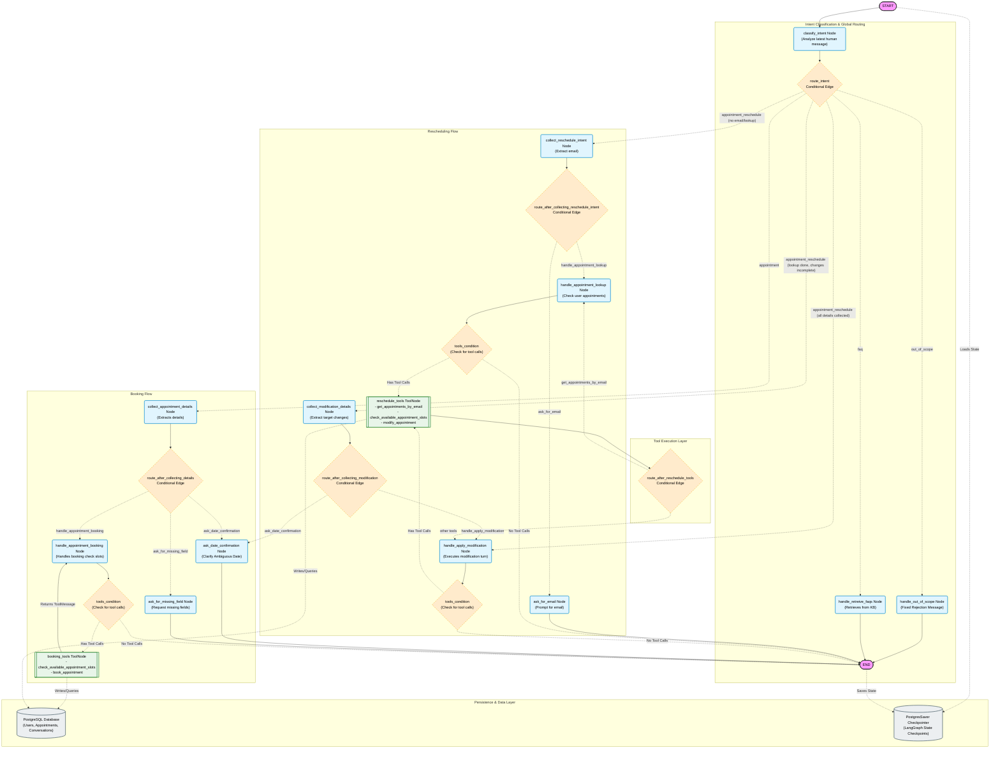

# Nova Wellness & Aesthetics - AI Concierge System

Welcome to the backend engine of Nova Desk, a luxury medical spa AI assistant. Powered by FastAPI and LangGraph, this backend orchestrates intent classification, dynamic scheduling, multi-turn booking/rescheduling, and conversational FAQ retrievals with enterprise-grade guardrails.
## 1. Backend Agent Engine (`back-end/`)

Powered by **FastAPI** and **LangGraph**, the backend hosts the conversational state machine, memory persistence, fuzzy matching systems, and DB-connected scheduling tools.

* **Vercel Deployed URL:** [https://nova-desk-ai-agent.vercel.app](https://nova-desk-ai-agent.vercel.app)

## 🚀 Key Features

* **Multi-Agent Orchestration**: Structured state machine using **LangGraph** to manage complex conversational paths, conditional routing, and cyclic loops.
* **Intelligent Intent Classification**: Dynamic classification of user messages into distinct flows (`faq`, `appointment`, `appointment_reschedule`, `human_escalation`, `out_of_scope`).
* **Robust Out-of-Scope Guardrails**: Zero-cost deterministic prompt filter bypassing the LLM for off-topic prompts to prevent jailbreaking/hijacking and save API tokens.
* **Context-Aware Booking**: Multi-turn dialogue collection for appointment details (Name, Email, Service, Date, Time) with validation.
* **Auto-Alternative Slot Finder**: Gracefully handle fully-booked slots by searching database schedules up to 7 days ahead and proposing nearest alternatives.
* **Fuzzy Service Matching**: Corrects user typos for service names (e.g., matching "botoxx" to "Botox") automatically using Levenshtein distance.
* **Possessive Identification**: Distinguishes Selection (*"Let's change Monday's appointment"*) from Rescheduling (*"Move the appointment to Monday"*).
* **Relative Date Math & Resolution**: Processes complex expressions like *"next day"*, *"tomorrow"*, or *"next Friday"* relative to target dates.
* **Date Ambiguity Disambiguation**: Holds the execution state to clarify ambiguous inputs (like just *"Friday"*) via conversational confirmation loops.
* **Tool Call Hallucination Fallback**: Safely catches LLM schema hallucinations, transitioning back to natural text chains without crashing.

---

## 🏗️ System Architecture & State Flow



---

## 🛠️ Technology Stack (Backend)

| Component | Technology | Description / Usage |
| :--- | :--- | :--- |
| **API Core** | [FastAPI](https://fastapi.tiangolo.com/) | High-performance, asynchronous REST API router |
| **State Machine** | [LangGraph](https://langchain-ai.github.io/langgraph/) | Handles conversation state, routing conditional edges, and loops |
| **LLM Interface** | [LangChain Core](https://github.com/langchain-ai/langchain) | Tool binding, structured outputs, and prompt templating |
| **Database ORM** | [SQLModel](https://sqlmodel.tiangolo.com/) | Modern Python SQL database wrapper combining SQLAlchemy & Pydantic |
| **Fuzzy Matching** | `difflib` (Python Standard Lib) | Levenshtein ratio matching for spa treatment validation |
| **Timezone Management** | `zoneinfo` | Standardized scheduling using local zone `Asia/Karachi` |

---

## 🌐 Hosting & Services (Backend)

* **State & Transactional DB (PostgreSQL)**: Hosted serverless on [Neon Tech](https://neon.tech/) (AWS `us-east-2`), utilizing connection poolers for high scalability.
* **Vector Database (RAG)**: Hosted on [Pinecone Serverless](https://www.pinecone.io/) using `cosine` similarity to store and query highly optimized embeddings.
* **Large Language Models (LLMs)**:
  * **Groq API**: High-speed LLaMA models for primary intent classification and text generation.
  * **Google Gemini API**: Utilizing `text-embedding-004` to generate 768-dimensional document vectors, alongside large-context models for complex date-math parsing.
* **Application API**: Deployed live on Render.

---

## 🛡️ Guardrails & Safety Architecture

### 1. Deterministic Out-of-Scope Filter
If a user requests tasks unrelated to the spa (e.g. *"Write a Python script"* or *"What is 15 * 30?"*):
* It is intercepted immediately at the `classify_intent` stage.
* The graph redirects to `handle_out_of_scope`.
* The server bypasses vector databases, tools, and heavy LLM chains entirely, returning a cached refusal message, avoiding unnecessary API charges.

### 2. State Checkpointing & Persistence
Using LangGraph's `PostgresSaver` checkpointing, the full conversation state is persisted automatically across the stateful graph:
* Every user-agent interaction step is versioned and saved using a `thread_id` (corresponds to the SQL database `Conversation.id`).
* This setup provides long-term application memory, fault tolerance for API timeouts, and unlocks the potential for "Time Travel" debugging or "Human-in-the-Loop" pausing.

### 3. Tool Binding Isolation
We maintain separate Tool Nodes (`booking_tool_node` and `reschedule_tool_node`) for different phases of the graph. This limits the agent's attack surface, ensuring rescheduling tools cannot accidentally run during booking phases.

---

## 📂 Project Structure (Backend)

```bash
back-end/
├── app/
│   ├── agent/
│   │   ├── graph.py       # LangGraph compilation, node declaration, and edges
│   │   ├── nodes.py       # Node implementation logic and prompts
│   │   ├── state.py       # AgentState TypedDict schema
│   │   ├── tools.py       # Database-bound tools (booking, modify slots)
│   │   └── chat_model.py  # Model initialization interfaces (Groq, Gemini)
│   ├── api/
│   │   ├── routes/
│   │   │   └── chat.py    # Main POST /chat API endpoint
│   │   └── dependencies.py# DB injection helper
│   ├── core/
│   │   ├── config.py      # Pydantic Settings
│   │   ├── database.py    # Database connection engine
│   │   └── vectordb.py    # Pinecone vector store retrieval setup
│   └── models/
│       └── domain.py      # SQLModel database tables (User, Appointment, Conversation, Message)
├── .env                   # Environment variables (Neon, Groq, Gemini, Pinecone)
└── requirements.txt       # Dependencies
```

---

## ⚙️ Running Locally (Backend)

1. **Install Dependencies**:
   ```bash
   pip install -r requirements.txt
   ```
2. **Setup Environment**:
   Make sure you copy and configure `.env` with the necessary keys (Neon PostgreSQL link, Groq/Gemini Keys, Pinecone API settings).
3. **Start the API Server**:
   ```bash
   uvicorn app.main:app --reload
   ```
   The backend API docs will be available at `http://localhost:8000/docs`.

---
---

## 2.  Frontend Dashboard (`front-end/`)

A luxury, clean visual interface for clients to chat with **Nova** and developers to inspect the state machine in real-time. Deployed on [Vercel](https://nova-desk-ai-agent.vercel.app).

## 🚀 Key Features

* **Real-time Dev Mode (State Inspector)**: A side-by-side debugging panel displaying the current conversation state, extracted entity variables, parsed intent, and executing tools on every message.
* **Latency Counter**: Displays response latency in milliseconds to monitor system and API performance.
* **Rich Markdown Support**: Fully parses Markdown text responses (including treatment lists, bold summaries, and line formatting) using `react-markdown`.
* **State Reset capability**: Single-click session wipe (`Reset Session`) to start fresh and reset checkpointer memory.
* **Interactive UI**: Elegant luxury spa design language, featuring smooth transitions, rounded cards, and dev tools toggle switches.

---

## 🛠️ Technology Stack (Frontend)

| Component | Technology | Description / Usage |
| :--- | :--- | :--- |
| **Framework** | [React 19](https://react.dev/) | Virtual DOM library for responsive UI layout |
| **Build Tool** | [Vite 8](https://vite.dev/) | Ultra-fast bundling, Hot Module Replacement (HMR), and server runner |
| **Markdown Parser**| [react-markdown](https://github.com/remarkjs/react-markdown) | Secure, native React component to render rich chat formats |
| **Oxlint** | [Oxlint](https://oxc.rs/docs/guide/usage/linter.html) | High performance JavaScript/JSX compiler and code-quality validator |
| **CSS styling** | Vanilla CSS | Fully customized tokens representing luxury spa styles, gradients, and custom components |

---

## 🌐 Hosting & Services (Frontend)

* **UI Hosting Platform**: Hosted on **Vercel** (`https://nova-desk-ai-agent.vercel.app`) with automatic deployment pipelines linked to GitHub.
* **API Integration**: Connects to the Render backend via `VITE_API_URL` configuration inside build-time environment variables.

---

## 📂 Project Structure (Frontend)

```bash
front-end/
├── public/                # Static public assets (icons, images)
├── src/
│   ├── assets/            # App branding (logos, graphics)
│   ├── components/        # Isolated UI sections:
│   │   ├── ChatPanel.jsx       # Chat window UI and message rendering
│   │   ├── InspectorPanel.jsx  # Live state tree visualizer for developers
│   │   └── JsonTree.jsx        # Recursive JSON structure viewer
│   ├── App.jsx            # Main app shell, local state manager, and API calls
│   ├── index.css          # Visual styles, color palettes, animations, and layouts
│   └── main.jsx           # Vite React mounting file
├── index.html             # Basic HTML entry point
├── package.json           # Scripts, metadata, and packages
└── vite.config.js         # Vite configuration with React compiler plugin
```

---

## ⚙️ Running Locally (Frontend)

1. **Install Dependencies**:
   ```bash
   npm install
   ```
2. **Setup Environment**:
   Create a `.env.local` file and add the local backend API server path:
   ```env
   VITE_API_URL=http://localhost:8080
   ```
3. **Start Dev Server**:
   ```bash
   npm run dev
   ```
   Open `http://localhost:5173` in your browser.
